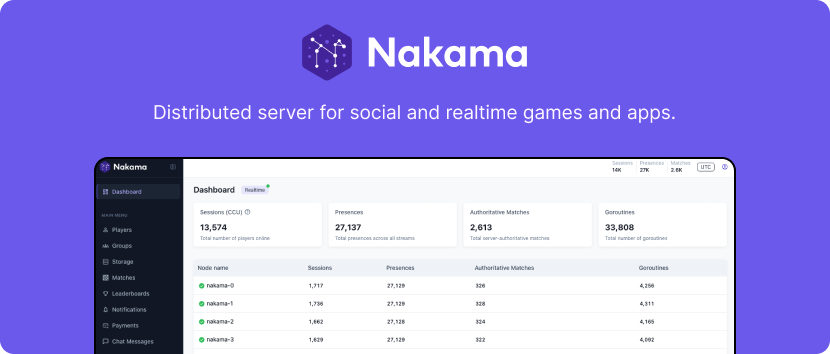

<p align="center">
  <a href="https://heroiclabs.com" target="_blank" rel="noopener">
    
  </a>
</p>

# Nakama Multi-Game Backend Platform

A production-ready, self-hosted Nakama server deployment with comprehensive game backend features for Unity developers. This platform provides everything needed to build engaging, social, competitive games with minimal backend development.

## Overview

This is a customized Nakama 3.x deployment that includes pre-built JavaScript runtime modules providing:

- ✅ **Dynamic Leaderboards** - Daily, weekly, monthly, and all-time rankings with automated resets
- ✅ **Seasonal Tournaments** - Competitive events with rewards and tiered leagues  
- ✅ **Daily Rewards & Streaks** - Login incentives with consecutive day tracking
- ✅ **Daily Missions System** - Configurable objectives with progress tracking
- ✅ **Groups/Clans/Guilds** - Community features with roles, shared wallets, and group chat
- ✅ **Friend System & Social Graph** - Add friends, block users, challenges, spectating
- ✅ **Economy & Wallet System** - Multi-currency support (global + per-game wallets)
- ✅ **Push Notifications** - AWS SNS/Pinpoint integration for iOS, Android, Web, Windows
- ✅ **In-App Notifications** - Real-time and persistent messaging
- ✅ **Battle Pass/Seasonal Progression** - Tiered rewards and XP systems
- ✅ **Analytics & Metrics** - Event tracking, DAU, session analytics
- ✅ **Cloud Save/Persistent Storage** - Player progression and data persistence
- ✅ **Purchase Validation** - IAP verification for app stores
- ✅ **Server-Side Validation Hooks** - Anti-cheat and fair play enforcement

## Architecture

### Multi-Game Support

All systems support multiple games through UUID-based `gameId` identifiers. Each game has isolated:
- Leaderboards (per-game + global cross-game)
- Wallets and currencies
- Daily missions and rewards
- Analytics and metrics
- Storage collections

### Platform Components

```
┌──────────────────────────────────────────────────────────┐
│                   Unity Game Client                       │
│          (C# with Nakama Unity SDK)                      │
└────────────────────┬─────────────────────────────────────┘
                     │ HTTPS/WebSocket
                     ├── Authentication (Device/Email/Cognito)
                     ├── RPC Calls (JavaScript Runtime)
                     ├── Realtime Features (Match, Chat, Notifications)
                     └── Storage & Leaderboards
                     │
┌────────────────────▼─────────────────────────────────────┐
│              Nakama Server (Go + JavaScript)             │
│  ┌──────────────────────────────────────────────────┐   │
│  │  JavaScript Runtime Modules (/data/modules/)     │   │
│  ├──────────────────────────────────────────────────┤   │
│  │  • leaderboards_timeperiod.js                    │   │
│  │  • daily_rewards/daily_rewards.js                │   │
│  │  • daily_missions/daily_missions.js              │   │
│  │  • wallet/wallet.js                              │   │
│  │  • friends/friends.js                            │   │
│  │  • groups/groups.js                              │   │
│  │  • analytics/analytics.js                        │   │
│  │  • push_notifications/push_notifications.js      │   │
│  │  • copilot/* (wallet mapping, social features)   │   │
│  └──────────────────────────────────────────────────┘   │
│                                                          │
│  Core Nakama Features:                                   │
│  • Authentication & User Management                      │
│  • Matchmaker & Realtime Multiplayer                    │
│  • Chat & Parties                                        │
│  • Tournaments                                           │
│  • Storage Engine                                        │
│  • Purchase Validation                                   │
└────────────────────┬─────────────────────────────────────┘
                     │
┌────────────────────▼─────────────────────────────────────┐
│         CockroachDB / PostgreSQL Database                │
│    (User data, leaderboards, storage, analytics)         │
└──────────────────────────────────────────────────────────┘
```

## Feature Matrix

| Feature | Impact | Games Supported | Auto-Reset | Description |
|---------|--------|-----------------|------------|-------------|
| **Time-Period Leaderboards** | ⭐⭐⭐⭐⭐ | Both QuizVerse & Last to Live | ✅ Daily/Weekly/Monthly | Competitive rankings with cron-based resets |
| **Daily Rewards & Streaks** | ⭐⭐⭐⭐☆ | Both | ✅ Daily at UTC 00:00 | Login incentives with streak bonuses |
| **Daily Missions** | ⭐⭐⭐⭐☆ | Both | ✅ Daily at UTC 00:00 | Quest system with XP and token rewards |
| **Groups/Clans/Guilds** | ⭐⭐⭐⭐☆ | Both | - | Community building with shared wallets |
| **Friend System** | ⭐⭐⭐⭐☆ | Both | - | Social graph, blocking, challenges |
| **Wallet & Economy** | ⭐⭐⭐⭐☆ | Both | - | Multi-currency (XUT, XP, tokens) |
| **Push Notifications** | ⭐⭐⭐⭐⭐ | Both | - | AWS SNS/Pinpoint for iOS/Android/Web/Windows |
| **In-App Notifications** | ⭐⭐⭐⭐☆ | Both | - | Real-time + persistent messaging |
| **Battle Pass** | ⭐⭐⭐⭐☆ | Both | - | Seasonal progression system |
| **Analytics** | ⭐⭐⭐☆☆ | Both | - | Event tracking and metrics |
| **Cloud Save** | ⭐⭐⭐☆☆ | Both | - | Persistent player data |
| **Tournaments** | ⭐⭐⭐⭐☆ | Both | Configurable | Competitive events with prizes |
| **Matchmaking** | ⭐⭐⭐⭐☆ | Both | - | Real-time 1v1, 2v2, 3v3, 4v4 |

## Quick Start

### For Unity Developers

1. **Get Your Game ID**
   - Register your game to receive a UUID (e.g., `7d4322ae-cd95-4cd9-b003-4ffad2dc31b4`)

2. **Install Nakama Unity SDK**
   ```bash
   # Via Unity Package Manager
   https://github.com/heroiclabs/nakama-unity.git?path=/Packages/Nakama
   ```

3. **Initialize & Authenticate**
   ```csharp
   using Nakama;
   
   var client = new Client("http", "your-server.com", 7350, "defaultkey");
   var session = await client.AuthenticateDeviceAsync(
       SystemInfo.deviceUniqueIdentifier, null, true);
   ```

4. **Use Features**
   ```csharp
   // Submit score to all leaderboards (1 RPC call)
   await client.RpcAsync(session, "submit_score_to_time_periods", 
       JsonUtility.ToJson(new { gameId = "YOUR-UUID", score = 1000 }));
   
   // Check daily reward
   await client.RpcAsync(session, "daily_rewards_get_status",
       JsonUtility.ToJson(new { gameId = "YOUR-UUID" }));
   
   // Get daily missions
   await client.RpcAsync(session, "get_daily_missions",
       JsonUtility.ToJson(new { gameId = "YOUR-UUID" }));
   ```

### For Server Operators

#### Docker Deployment (Recommended)

1. **Create docker-compose.yml**
   ```yaml
   version: '3'
   services:
     cockroachdb:
       image: cockroachdb/cockroach:latest
       command: start-single-node --insecure --store=attrs=ssd,path=/var/lib/cockroach/
       restart: "no"
       volumes:
         - data:/var/lib/cockroach
       ports:
         - "26257:26257"
         - "8080:8080"
     
     nakama:
       image: heroiclabs/nakama:3.22.0
       depends_on:
         - cockroachdb
       volumes:
         - ./data/modules:/nakama/data/modules
       environment:
         - "NAKAMA_DATABASE_ADDRESS=root@cockroachdb:26257"
       ports:
         - "7350:7350"
         - "7351:7351"
       restart: "no"
   
   volumes:
     data:
   ```

2. **Start Services**
   ```bash
   docker-compose up -d
   ```

3. **Access Nakama Console**
   - Navigate to http://localhost:7351
   - Default credentials: admin / password

#### Binary Deployment

1. **Download Nakama**
   - Get the latest release from [GitHub Releases](https://github.com/heroiclabs/nakama/releases)

2. **Setup Database**
   ```bash
   # Start CockroachDB
   cockroach start-single-node --insecure
   
   # Run migrations
   nakama migrate up --database.address "root@127.0.0.1:26257"
   ```

3. **Start Nakama**
   ```bash
   nakama --database.address "root@127.0.0.1:26257"
   ```

## Documentation

### Complete Guides

- **[UNITY_DEVELOPER_COMPLETE_GUIDE.md](./UNITY_DEVELOPER_COMPLETE_GUIDE.md)** - Complete Unity SDK integration manual
  - SDK initialization and authentication flows
  - All feature modules with C# code examples
  - GameID-based architecture
  - Error handling and security
  - Platform-specific considerations (WebGL, iOS, Android)

- **[SAMPLE_GAME_COMPLETE_INTEGRATION.md](./SAMPLE_GAME_COMPLETE_INTEGRATION.md)** - End-to-end integration example
  - Complete sample game using ALL features
  - Step-by-step integration workflows
  - Real C# code snippets
  - Battle system, leaderboards, guilds, rewards
  - Testing and deployment guide

### Available RPCs

| Category | RPC Endpoint | Description |
|----------|-------------|-------------|
| **Leaderboards** | `create_time_period_leaderboards` | Initialize all leaderboards (admin) |
| | `submit_score_to_time_periods` | Submit to all time-period leaderboards |
| | `get_time_period_leaderboard` | Get rankings for specific period |
| **Daily Rewards** | `daily_rewards_get_status` | Check claim status and streak |
| | `daily_rewards_claim` | Claim today's reward |
| **Missions** | `get_daily_missions` | Get all missions with progress |
| | `submit_mission_progress` | Update mission progress |
| | `claim_mission_reward` | Claim completed mission |
| **Wallet** | `wallet_get_all` | Get all wallets (global + games) |
| | `wallet_update_game_wallet` | Update per-game currency |
| | `wallet_transfer_between_game_wallets` | Transfer between games |
| **Friends** | `friends_block` / `friends_unblock` | Block/unblock users |
| | `friends_list` | Get friends with online status |
| | `friends_challenge_user` | Send game challenge |
| | `friends_spectate` | Spectate friend's match |
| **Groups** | `create_game_group` | Create clan/guild |
| | `get_user_groups` | Get user's groups |
| | `update_group_xp` | Add XP to group |
| | `get_group_wallet` | Get group shared wallet |
| **Push Notifications** | `push_register_token` | Register device push token (Unity → Lambda) |
| | `push_send_event` | Send push notification event |
| | `push_get_endpoints` | Get user's registered devices |
| **Analytics** | `analytics_log_event` | Log custom events |
| **Cognito** | `get_user_wallet` | Get/create Cognito-linked wallet |
| | `link_wallet_to_game` | Link wallet to game |

## Push Notifications (AWS SNS + Pinpoint)

### Architecture Overview

The push notification system integrates **AWS SNS (Simple Notification Service)** and **AWS Pinpoint** to deliver push notifications across all major platforms:

```
┌─────────────────────────────────────────────────────────────┐
│                    Unity Game Client                         │
│  (iOS / Android / WebGL / Windows)                          │
│  - Obtains push token from OS                               │
│  - NO AWS SDK required                                      │
└──────────────────┬──────────────────────────────────────────┘
                   │ Send raw device token
                   ▼
┌─────────────────────────────────────────────────────────────┐
│                    Nakama Server                            │
│  RPC: push_register_token                                   │
│  - Receives: { gameId, platform, token }                    │
│  - Stores metadata                                          │
└──────────────────┬──────────────────────────────────────────┘
                   │ HTTP POST to Lambda Function URL
                   ▼
┌─────────────────────────────────────────────────────────────┐
│              AWS Lambda (Function URL)                      │
│  - Creates/Updates SNS Platform Endpoint                    │
│  - Registers with Pinpoint for analytics                    │
│  - Returns: { snsEndpointArn }                             │
└──────────────────┬──────────────────────────────────────────┘
                   │
                   ▼
┌─────────────────────────────────────────────────────────────┐
│         AWS SNS Platform Application                        │
│  - APNS (iOS)                                               │
│  - FCM (Android, Web)                                       │
│  - WNS (Windows)                                            │
└─────────────────────────────────────────────────────────────┘
```

### Server Configuration

Set environment variables for Lambda Function URLs:

```bash
# Lambda URL for registering push endpoints
export PUSH_LAMBDA_URL="https://xxxxx.lambda-url.us-east-1.on.aws/register-endpoint"

# Lambda URL for sending push notifications
export PUSH_SEND_URL="https://xxxxx.lambda-url.us-east-1.on.aws/send-push"
```

### Supported Platforms

| Platform | Token Type | AWS Service |
|----------|-----------|-------------|
| **iOS** | APNS Token | AWS SNS APNS Platform Application |
| **Android** | FCM Token | AWS SNS FCM Platform Application |
| **Web (PWA)** | FCM Token | AWS SNS FCM Platform Application |
| **Windows** | WNS Token | AWS SNS WNS Platform Application |

### Push Event Types

The system automatically triggers push notifications for:

- ✅ **Daily Reward Available** - Remind users to claim daily login bonus
- ✅ **Mission Completed** - Notify when objectives are achieved
- ✅ **Streak Break Warning** - Alert before streak expires (47h mark)
- ✅ **Friend Request** - New friend request received
- ✅ **Friend Online** - Friend comes online
- ✅ **Challenge Invite** - Friend challenges you to a match
- ✅ **Match Ready** - Matchmaking found opponents
- ✅ **Wallet Reward Drop** - Currency or items received
- ✅ **New Season / Quiz Pack** - New content available

### Unity Integration

See [UNITY_DEVELOPER_COMPLETE_GUIDE.md](./UNITY_DEVELOPER_COMPLETE_GUIDE.md) for complete C# examples showing how to:
1. Obtain device tokens (APNS/FCM/WNS)
2. Register tokens with `push_register_token` RPC
3. Handle incoming push notifications
4. Trigger server-side push events

## Engagement Loop Design

This platform implements proven engagement patterns:

### 🧠 Competitive Mastery Loop
- Time-period leaderboards (daily/weekly/monthly/all-time)
- Friend-only and global rankings
- Multiple metrics (score, survival time, accuracy)

### 🕑 Urgency & Return Loop  
- Daily rewards with streak bonuses
- Daily missions with 24-hour resets
- Tournament start/end notifications

### 🔁 Habit Loop
- Daily login rewards
- Streak tracking (Day 7 = bonus)
- Mission completion dopamine hits

### 🎯 Progression Loop
- Battle pass with free and premium tiers
- Group/clan XP and leveling
- Achievement milestones

### 💬 Social FOMO Loop
- Friend online notifications
- Challenge system
- Spectator mode
- Group chat channels

### 🏰 Cooperative Investment Loop
- Clan shared wallets
- Group quests and XP
- Territory/leaderboard competition

### 💰 Reward & Utility Loop
- Multi-currency economy (XUT, XP, tokens)
- Transparent transaction logs
- Loot box and milestone rewards

### 🔐 Fair Play Loop
- Server-side validation hooks
- Anti-cheat timing validation
- Replay attack prevention

## Server Features (Core Nakama)

Beyond the custom modules, Nakama provides:

- **Authentication** - Device, email, social, custom
- **Matchmaker** - Realtime match finding
- **Realtime Multiplayer** - WebSocket-based gameplay
- **Chat** - 1-on-1, group, global channels
- **Parties** - Team formation and voice chat prep
- **Storage** - Key-value and collections
- **RPC** - Custom server logic (JavaScript/Lua/Go)
- **Purchase Validation** - Apple, Google, Huawei IAP
- **Console** - Web UI for data management

See [official Nakama documentation](https://heroiclabs.com/docs) for core features.

## Production Deployment

### Recommended Infrastructure

**Database (CockroachDB/PostgreSQL):**
- Minimum: 3 nodes for high availability
- Instance type: 4 vCPU, 16 GB RAM minimum
- Storage: SSD with auto-scaling
- [Production settings guide](https://www.cockroachlabs.com/docs/stable/recommended-production-settings.html)

**Nakama Server:**
- Minimum: n1-standard-2 (2 vCPU, 7.5 GB RAM) on GCP
- Recommended: n1-standard-4 for production
- Load balancing for horizontal scaling
- TLS/SSL certificates required

### Cloud Providers

- Google Cloud Platform (GCP) - Recommended
- Amazon Web Services (AWS)
- Microsoft Azure
- Digital Ocean
- Self-hosted / Private cloud

### Heroic Cloud

For managed hosting, consider [Heroic Cloud](https://heroiclabs.com/heroic-cloud/) which handles:
- Server uptime and monitoring
- Database replication and backups
- Log aggregation
- Automatic updates
- 24/7 support

## Support & Resources

### Documentation
- 📖 [Unity Developer Complete Guide](./UNITY_DEVELOPER_COMPLETE_GUIDE.md)
- 🎮 [Sample Game Integration](./SAMPLE_GAME_COMPLETE_INTEGRATION.md)
- 🌐 [Official Nakama Docs](https://heroiclabs.com/docs)

### Community
- 💬 [Nakama Forum](https://forum.heroiclabs.com)
- 📺 [YouTube Tutorials](https://www.youtube.com/c/HeroicLabs)
- 🐦 [Twitter @heroicdev](https://twitter.com/heroicdev)

### Developer Resources
- [Nakama Unity SDK](https://github.com/heroiclabs/nakama-unity)
- [Server Source Code](https://github.com/heroiclabs/nakama)
- [Example Projects](https://heroiclabs.com/docs/examples/)

## Contributing

This is a self-hosted deployment. For the core Nakama server contributions, see the [official repository](https://github.com/heroiclabs/nakama).

For custom module improvements in this deployment:
1. Test thoroughly with your gameId
2. Document all changes
3. Submit for review with test results

## License

- **Nakama Server**: Apache 2.0 License
- **Custom Modules** (/data/modules/): Check individual module headers

See [LICENSE](./LICENSE) for Nakama core license.

---

**Built with** [Nakama](https://heroiclabs.com) - The open-source game server  
**Version**: 3.22.0  
**Runtime**: JavaScript + Go  
**Database**: CockroachDB/PostgreSQL
