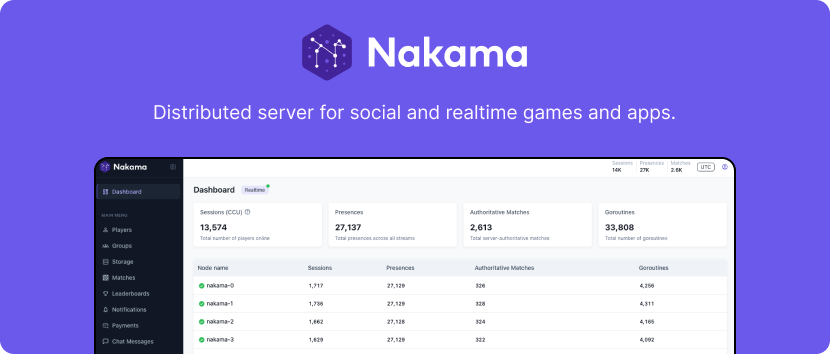

<p align="center">
  <a href="https://heroiclabs.com" target="_blank" rel="noopener">
    
  </a>
</p>

# Nakama Multi-Game Backend Platform

A production-ready, self-hosted Nakama server deployment with comprehensive game backend features for Unity developers. This platform provides everything needed to build engaging, social, competitive games with minimal backend development.

## ⚠️ Important: JavaScript Runtime Uses ES Modules

**If you're getting this error:**
```
ReferenceError: require is not defined
Failed to eval JavaScript modules
```

**Your JavaScript modules are using CommonJS syntax, which Nakama 3.x does NOT support.**

Nakama's JavaScript runtime only supports **ES Modules (ESM)**:
- ✅ Use `import` and `export`, NOT `require()` and `module.exports`
- ✅ See **[ESM_MIGRATION_COMPLETE_GUIDE.md](./ESM_MIGRATION_COMPLETE_GUIDE.md)** for the complete solution

**Quick Links:**
- 📘 [Complete ESM Migration Guide](./_archived_docs/esm_guides/ESM_MIGRATION_COMPLETE_GUIDE.md) - Start here if you have the error
- 📘 [JavaScript ESM Guide](./_archived_docs/esm_guides/NAKAMA_JAVASCRIPT_ESM_GUIDE.md) - Detailed JavaScript guide
- 📘 [TypeScript ESM Build Guide](./_archived_docs/esm_guides/NAKAMA_TYPESCRIPT_ESM_BUILD.md) - TypeScript configuration
- 📘 [Docker ESM Deployment Guide](./_archived_docs/esm_guides/NAKAMA_DOCKER_ESM_DEPLOYMENT.md) - Docker setup
- 📁 [Working Examples](./examples/esm-modules/) - Copy-paste ready code

---

## 📚 Documentation

**Start Here:**
- 📖 **[DOCS_INDEX.md](./DOCS_INDEX.md)** - Complete documentation index
- 📖 **[NAKAMA_COMPLETE_DOCUMENTATION.md](./NAKAMA_COMPLETE_DOCUMENTATION.md)** - Master documentation
- 🎮 **[GAME_ONBOARDING_GUIDE.md](./GAME_ONBOARDING_GUIDE.md)** - Add new games
- 🎯 **[UNITY_DEVELOPER_COMPLETE_GUIDE.md](./UNITY_DEVELOPER_COMPLETE_GUIDE.md)** - Unity integration

**All documentation has been consolidated. See [DOCS_INDEX.md](./DOCS_INDEX.md) for the complete list.**

---

## Overview

This is a customized Nakama 3.x deployment that includes pre-built JavaScript runtime modules providing:

- ✅ **Dynamic Leaderboards** - Daily, weekly, monthly, and all-time rankings with automated resets
- ✅ **Seasonal Tournaments** - Competitive events with rewards and tiered leagues  
- ✅ **Daily Rewards & Streaks** - Login incentives with consecutive day tracking
- ✅ **Daily Missions System** - Configurable objectives with progress tracking
- ✅ **Groups/Clans/Guilds** - Community features with roles, shared wallets, and group chat
- ✅ **Friend System & Social Graph** - Add friends, block users, challenges, spectating
- ✅ **Economy & Wallet System** - Multi-currency support (global + per-game wallets)
- ✅ **Push Notifications** - AWS SNS/Pinpoint integration for iOS, Android, Web, Windows
- ✅ **In-App Notifications** - Real-time and persistent messaging
- ✅ **Battle Pass/Seasonal Progression** - Tiered rewards and XP systems
- ✅ **Analytics & Metrics** - Event tracking, DAU, session analytics
- ✅ **Cloud Save/Persistent Storage** - Player progression and data persistence
- ✅ **Purchase Validation** - IAP verification for app stores
- ✅ **Server-Side Validation Hooks** - Anti-cheat and fair play enforcement

## Architecture

### Multi-Game Identity, Wallet, and Leaderboard System

This platform now includes a **comprehensive multi-game architecture** supporting:

- **Device-Based Identity**: Each player is identified by `device_id` + `game_id` combination
- **Dual-Wallet System**: Per-game wallets + shared global wallet across all games
- **Comprehensive Leaderboards**: Automatic score submission to ALL leaderboard types

#### Architecture Diagram

```
┌─────────────────────────────────────────────────────────────┐
│                  Unity Game Client                          │
│                  (device_id + game_id)                      │
└────────────────────┬────────────────────────────────────────┘
                     │
                     ├── 1. create_or_sync_user
                     │   Input: {username, device_id, game_id}
                     │   Output: {wallet_id, global_wallet_id}
                     │
┌────────────────────▼────────────────────────────────────────┐
│              Identity Management Layer                      │
│  ┌──────────────────────────────────────────────────────┐  │
│  │ Storage: "quizverse"                                 │  │
│  │ Key: "identity:<device_id>:<game_id>"               │  │
│  │ Value: {username, wallet_id, global_wallet_id}      │  │
│  └──────────────────────────────────────────────────────┘  │
└─────────────────────────────────────────────────────────────┘
                     │
                     ├── 2. create_or_get_wallet
                     │   Input: {device_id, game_id}
                     │   Output: {game_wallet, global_wallet}
                     │
┌────────────────────▼────────────────────────────────────────┐
│                 Wallet Management Layer                     │
│  ┌─────────────────────────┬──────────────────────────┐    │
│  │  Per-Game Wallet        │   Global Wallet          │    │
│  │  Key: wallet:<device>:  │   Key: wallet:<device>:  │    │
│  │       <game_id>         │       global             │    │
│  │  Balance: game score    │   Balance: cross-game    │    │
│  └─────────────────────────┴──────────────────────────┘    │
└─────────────────────────────────────────────────────────────┘
                     │
                     ├── 3. submit_score_and_sync
                     │   Input: {score, device_id, game_id}
                     │   Output: {leaderboards_updated[], wallet_balance}
                     │
┌────────────────────▼────────────────────────────────────────┐
│            Comprehensive Leaderboard System                 │
│                                                              │
│  Per-Game Leaderboards:                                     │
│  ├── leaderboard_<game_id>                (main)           │
│  ├── leaderboard_<game_id>_daily          (resets daily)   │
│  ├── leaderboard_<game_id>_weekly         (resets weekly)  │
│  ├── leaderboard_<game_id>_monthly        (resets monthly) │
│  └── leaderboard_<game_id>_alltime        (never resets)   │
│                                                              │
│  Global Leaderboards (cross-game):                          │
│  ├── leaderboard_global                   (main)           │
│  ├── leaderboard_global_daily                              │
│  ├── leaderboard_global_weekly                             │
│  ├── leaderboard_global_monthly                            │
│  └── leaderboard_global_alltime                            │
│                                                              │
│  Friends Leaderboards:                                      │
│  ├── leaderboard_friends_<game_id>                         │
│  └── leaderboard_friends_global                            │
│                                                              │
│  Registry Leaderboards:                                     │
│  └── All leaderboards from registry matching game/global   │
└─────────────────────────────────────────────────────────────┘
```

#### Data Flow: Player Journey

```
1. Game Launch
   ├── Generate/Retrieve device_id
   └── Call create_or_sync_user(username, device_id, game_id)
       ├── Creates identity if new
       ├── Creates per-game wallet (balance: 0)
       ├── Creates global wallet (balance: 0)
       └── Returns wallet IDs

2. Load Wallets
   └── Call create_or_get_wallet(device_id, game_id)
       └── Returns {game_wallet, global_wallet}

3. Game Play
   └── Player achieves score

4. Submit Score
   └── Call submit_score_and_sync(score, device_id, game_id)
       ├── Writes to 12+ leaderboards automatically:
       │   ├── Game leaderboards (5 types)
       │   ├── Global leaderboards (5 types)
       │   ├── Friends leaderboards (2 types)
       │   └── Registry leaderboards (auto-detected)
       ├── Updates game wallet balance = score
       └── Returns leaderboards_updated[]

5. View All Leaderboards
   └── Call get_all_leaderboards(device_id, game_id, limit)
       ├── Retrieves records from all leaderboard types
       ├── Returns user's own record for each leaderboard
       ├── Includes pagination cursors
       └── Returns {leaderboards: {...}, total_leaderboards, ...}

6. View Individual Leaderboards
   └── Read from any leaderboard using Nakama SDK
```

### Multi-Game Support

All systems support multiple games through UUID-based `gameId` identifiers. Each game has isolated:
- Leaderboards (per-game + global cross-game)
- Wallets and currencies
- Daily missions and rewards
- Analytics and metrics
- Storage collections

### Platform Components

```
┌──────────────────────────────────────────────────────────┐
│                   Unity Game Client                       │
│          (C# with Nakama Unity SDK)                      │
└────────────────────┬─────────────────────────────────────┘
                     │ HTTPS/WebSocket
                     ├── Authentication (Device/Email/Cognito)
                     ├── RPC Calls (JavaScript Runtime)
                     ├── Realtime Features (Match, Chat, Notifications)
                     └── Storage & Leaderboards
                     │
┌────────────────────▼─────────────────────────────────────┐
│              Nakama Server (Go + JavaScript)             │
│  ┌──────────────────────────────────────────────────┐   │
│  │  JavaScript Runtime Modules (/data/modules/)     │   │
│  ├──────────────────────────────────────────────────┤   │
│  │  • leaderboards_timeperiod.js                    │   │
│  │  • daily_rewards/daily_rewards.js                │   │
│  │  • daily_missions/daily_missions.js              │   │
│  │  • wallet/wallet.js                              │   │
│  │  • friends/friends.js                            │   │
│  │  • groups/groups.js                              │   │
│  │  • analytics/analytics.js                        │   │
│  │  • push_notifications/push_notifications.js      │   │
│  │  • copilot/leaderboard_sync.js                  │   │
│  │  • copilot/leaderboard_aggregate.js             │   │
│  │  • copilot/leaderboard_friends.js               │   │
│  │  • copilot/social_features.js                   │   │
│  │  • copilot/cognito_wallet_mapper.js             │   │
│  └──────────────────────────────────────────────────┘   │
│                                                          │
│  Core Nakama Features:                                   │
│  • Authentication & User Management                      │
│  • Matchmaker & Realtime Multiplayer                    │
│  • Chat & Parties                                        │
│  • Tournaments                                           │
│  • Storage Engine                                        │
│  • Purchase Validation                                   │
└────────────────────┬─────────────────────────────────────┘
                     │
┌────────────────────▼─────────────────────────────────────┐
│         CockroachDB / PostgreSQL Database                │
│    (User data, leaderboards, storage, analytics)         │
└──────────────────────────────────────────────────────────┘
```

## Feature Matrix

| Feature | Impact | Games Supported | Auto-Reset | Description |
|---------|--------|-----------------|------------|-------------|
| **Time-Period Leaderboards** | ⭐⭐⭐⭐⭐ | Both QuizVerse & Last to Live | ✅ Daily/Weekly/Monthly | Competitive rankings with cron-based resets |
| **Daily Rewards & Streaks** | ⭐⭐⭐⭐☆ | Both | ✅ Daily at UTC 00:00 | Login incentives with streak bonuses |
| **Daily Missions** | ⭐⭐⭐⭐☆ | Both | ✅ Daily at UTC 00:00 | Quest system with XP and token rewards |
| **Groups/Clans/Guilds** | ⭐⭐⭐⭐☆ | Both | - | Community building with shared wallets |
| **Friend System** | ⭐⭐⭐⭐☆ | Both | - | Social graph, blocking, challenges |
| **Wallet & Economy** | ⭐⭐⭐⭐☆ | Both | - | Multi-currency (XUT, XP, tokens) |
| **Push Notifications** | ⭐⭐⭐⭐⭐ | Both | - | AWS SNS/Pinpoint for iOS/Android/Web/Windows |
| **In-App Notifications** | ⭐⭐⭐⭐☆ | Both | - | Real-time + persistent messaging |
| **Battle Pass** | ⭐⭐⭐⭐☆ | Both | - | Seasonal progression system |
| **Analytics** | ⭐⭐⭐☆☆ | Both | - | Event tracking and metrics |
| **Cloud Save** | ⭐⭐⭐☆☆ | Both | - | Persistent player data |
| **Tournaments** | ⭐⭐⭐⭐☆ | Both | Configurable | Competitive events with prizes |
| **Matchmaking** | ⭐⭐⭐⭐☆ | Both | - | Real-time 1v1, 2v2, 3v3, 4v4 |

## Quick Start

### For Unity Developers (3-Step Integration)

This platform provides a simple 3-RPC integration for any Unity game:

#### Step 1: Create or Sync User Identity

```csharp
using Nakama;

var client = new Client("http", "your-server.com", 7350, "defaultkey");
var session = await client.AuthenticateDeviceAsync(
    SystemInfo.deviceUniqueIdentifier, null, true);

// Create/sync user with your game
var payload = new {
    username = "PlayerName",
    device_id = SystemInfo.deviceUniqueIdentifier,
    game_id = "your-game-uuid"  // YOUR GAME ID
};
var result = await client.RpcAsync(session, "create_or_sync_user", JsonUtility.ToJson(payload));
// Returns: {wallet_id, global_wallet_id}
```

#### Step 2: Get Wallets

```csharp
var walletPayload = new {
    device_id = SystemInfo.deviceUniqueIdentifier,
    game_id = "your-game-uuid"
};
var wallets = await client.RpcAsync(session, "create_or_get_wallet", JsonUtility.ToJson(walletPayload));
// Returns: {game_wallet: {balance: 0}, global_wallet: {balance: 0}}
```

#### Step 3: Submit Score

```csharp
var scorePayload = new {
    score = 1500,
    device_id = SystemInfo.deviceUniqueIdentifier,
    game_id = "your-game-uuid"
};
var scoreResult = await client.RpcAsync(session, "submit_score_and_sync", JsonUtility.ToJson(scorePayload));
// Automatically updates 12+ leaderboards + wallet balance
```

#### Step 4: Get All Leaderboards

```csharp
var leaderboardPayload = new {
    device_id = SystemInfo.deviceUniqueIdentifier,
    game_id = "your-game-uuid",
    limit = 10  // Top 10 per leaderboard
};
var allLeaderboards = await client.RpcAsync(session, "get_all_leaderboards", JsonUtility.ToJson(leaderboardPayload));
// Returns: All leaderboards with records, user's rank, pagination cursors
```

**That's it!** Your game now has:
- ✅ Per-game and global wallets
- ✅ 5 time-period game leaderboards (main, daily, weekly, monthly, all-time)
- ✅ 5 time-period global leaderboards
- ✅ 2 friends leaderboards
- ✅ All registry leaderboards auto-detected

### Core RPCs Summary

This platform provides 4 essential RPCs for multi-game integration:

| RPC | Purpose | Input | Output |
|-----|---------|-------|--------|
| **create_or_sync_user** | Create/retrieve player identity | `{username, device_id, game_id}` | `{wallet_id, global_wallet_id}` |
| **create_or_get_wallet** | Get per-game + global wallets | `{device_id, game_id}` | `{game_wallet, global_wallet}` |
| **submit_score_and_sync** | Submit score to ALL leaderboards | `{score, device_id, game_id}` | `{leaderboards_updated[], wallet_balance}` |
| **get_all_leaderboards** | Retrieve all leaderboard data | `{device_id, game_id, limit}` | `{leaderboards: {...}, total_leaderboards}` |

### Complete Documentation

📚 **Start Here**: [Unity Quick Start Guide](./docs/unity/Unity-Quick-Start.md)

**Core Concepts**:
- [Identity System](./docs/identity.md) - Device-based identity with game segmentation
- [Wallet System](./docs/wallets.md) - Per-game and global wallet architecture
- [Leaderboards](./docs/leaderboards.md) - All leaderboard types explained

**Tutorials**:
- [Sample Game Tutorial](./docs/sample-game/README.md) - Complete quiz game with full integration
- [Integration Checklist](./docs/integration-checklist.md) - Step-by-step checklist for developers

**API Reference**:
- [API Documentation](./docs/api/README.md) - Complete RPC reference with examples

### Traditional Quick Start

### For Unity Developers

1. **Get Your Game ID**
   - Register your game to receive a UUID (e.g., `7d4322ae-cd95-4cd9-b003-4ffad2dc31b4`)

2. **Install Nakama Unity SDK**
   ```bash
   # Via Unity Package Manager
   https://github.com/heroiclabs/nakama-unity.git?path=/Packages/Nakama
   ```

3. **Initialize & Authenticate**
   ```csharp
   using Nakama;
   
   var client = new Client("http", "your-server.com", 7350, "defaultkey");
   var session = await client.AuthenticateDeviceAsync(
       SystemInfo.deviceUniqueIdentifier, null, true);
   ```

4. **Use Features**
   ```csharp
   // Submit score to all leaderboards (1 RPC call)
   await client.RpcAsync(session, "submit_score_to_time_periods", 
       JsonUtility.ToJson(new { gameId = "YOUR-UUID", score = 1000 }));
   
   // Check daily reward
   await client.RpcAsync(session, "daily_rewards_get_status",
       JsonUtility.ToJson(new { gameId = "YOUR-UUID" }));
   
   // Get daily missions
   await client.RpcAsync(session, "get_daily_missions",
       JsonUtility.ToJson(new { gameId = "YOUR-UUID" }));
   ```

### For Server Operators

#### Docker Deployment (Recommended)

1. **Create docker-compose.yml**
   ```yaml
   version: '3'
   services:
     cockroachdb:
       image: cockroachdb/cockroach:latest
       command: start-single-node --insecure --store=attrs=ssd,path=/var/lib/cockroach/
       restart: "no"
       volumes:
         - data:/var/lib/cockroach
       ports:
         - "26257:26257"
         - "8080:8080"
     
     nakama:
       image: heroiclabs/nakama:3.22.0
       depends_on:
         - cockroachdb
       volumes:
         - ./data/modules:/nakama/data/modules
       environment:
         - "NAKAMA_DATABASE_ADDRESS=root@cockroachdb:26257"
       ports:
         - "7350:7350"
         - "7351:7351"
       restart: "no"
   
   volumes:
     data:
   ```

2. **Start Services**
   ```bash
   docker-compose up -d
   ```

3. **Access Nakama Console**
   - Navigate to http://localhost:7351
   - Default credentials: admin / password

#### Binary Deployment

1. **Download Nakama**
   - Get the latest release from [GitHub Releases](https://github.com/heroiclabs/nakama/releases)

2. **Setup Database**
   ```bash
   # Start CockroachDB
   cockroach start-single-node --insecure
   
   # Run migrations
   nakama migrate up --database.address "root@127.0.0.1:26257"
   ```

3. **Start Nakama**
   ```bash
   nakama --database.address "root@127.0.0.1:26257"
   ```

## Documentation

### Complete Guides

- **[UNITY_DEVELOPER_COMPLETE_GUIDE.md](./UNITY_DEVELOPER_COMPLETE_GUIDE.md)** - Complete Unity SDK integration manual
  - SDK initialization and authentication flows
  - All feature modules with C# code examples
  - GameID-based architecture
  - Error handling and security
  - Platform-specific considerations (WebGL, iOS, Android)

- **[SAMPLE_GAME_COMPLETE_INTEGRATION.md](./SAMPLE_GAME_COMPLETE_INTEGRATION.md)** - End-to-end integration example
  - Complete sample game using ALL features
  - Step-by-step integration workflows
  - Real C# code snippets
  - Battle system, leaderboards, guilds, rewards
  - Testing and deployment guide

### Available RPCs

| Category | RPC Endpoint | Description |
|----------|-------------|-------------|
| **Standard Player RPCs** | `create_player_wallet` | **NEW** - Create player wallet (game + global) |
| | `update_wallet_balance` | **NEW** - Update wallet balance |
| | `get_wallet_balance` | **NEW** - Get wallet balances |
| | `submit_leaderboard_score` | **NEW** - Submit score to all leaderboards |
| | `get_leaderboard` | **NEW** - Get leaderboard records |
| **Leaderboards** | `create_time_period_leaderboards` | Initialize all leaderboards (admin) |
| | `submit_score_to_time_periods` | Submit to all time-period leaderboards |
| | `get_time_period_leaderboard` | Get rankings for specific period |
| **Daily Rewards** | `daily_rewards_get_status` | Check claim status and streak |
| | `daily_rewards_claim` | Claim today's reward |
| **Missions** | `get_daily_missions` | Get all missions with progress |
| | `submit_mission_progress` | Update mission progress |
| | `claim_mission_reward` | Claim completed mission |
| **Wallet** | `wallet_get_all` | Get all wallets (global + games) |
| | `wallet_update_game_wallet` | Update per-game currency |
| | `wallet_transfer_between_game_wallets` | Transfer between games |
| **Friends** | `friends_block` / `friends_unblock` | Block/unblock users |
| | `friends_list` | Get friends with online status |
| | `friends_challenge_user` | Send game challenge |
| | `friends_spectate` | Spectate friend's match |
| **Groups** | `create_game_group` | Create clan/guild |
| | `get_user_groups` | Get user's groups |
| | `update_group_xp` | Add XP to group |
| | `get_group_wallet` | Get group shared wallet |
| **Push Notifications** | `push_register_token` | Register device push token (Unity → Lambda) |
| | `push_send_event` | Send push notification event |
| | `push_get_endpoints` | Get user's registered devices |
| **Analytics** | `analytics_log_event` | Log custom events |
| **Cognito** | `get_user_wallet` | Get/create Cognito-linked wallet |
| | `link_wallet_to_game` | Link wallet to game |
| **Copilot Leaderboards** | `submit_score_sync` | Sync score to per-game and global leaderboards |
| | `submit_score_with_aggregate` | Submit score with aggregate Power Rank calculation |
| | `create_all_leaderboards_with_friends` | Create friend-specific leaderboards |
| | `submit_score_with_friends_sync` | Submit to both regular and friend leaderboards |
| | `get_friend_leaderboard` | Get leaderboard filtered by friends |
| **Copilot Social** | `send_friend_invite` | Send friend request with notification |
| | `accept_friend_invite` | Accept friend request |
| | `decline_friend_invite` | Decline friend request |
| | `get_notifications` | Get user notifications |

**📘 NEW: Standard Player RPCs Documentation**  
For detailed documentation on the new standard player RPCs, see:
- [Player RPC Documentation](./docs/RPC_DOCUMENTATION.md) - Complete API reference with Unity examples
- [Missing RPCs Status](./docs/MISSING_RPCS_STATUS.md) - Quick implementation status guide

## Copilot Advanced Features

The Copilot module provides advanced leaderboard synchronization and social features for multi-game platforms.

### Score Synchronization & Aggregation

**Single Score, Multiple Leaderboards**

- `submit_score_sync` - Automatically syncs a single score to both per-game (`leaderboard_{gameId}`) and global (`leaderboard_global`) leaderboards
- `submit_score_with_aggregate` - Calculates aggregate "Power Rank" across all games a player participates in

**Use Cases:**
- Track player performance in individual games AND across your entire game portfolio
- Create cross-game competitive rankings
- Award players for being top performers across multiple titles

### Friend Leaderboards

**Social Competitive Features**

- `create_all_leaderboards_with_friends` - Sets up parallel friend-only leaderboards for all games
- `submit_score_with_friends_sync` - Submit scores to both public and friend-only leaderboards
- `get_friend_leaderboard` - Retrieve rankings filtered to user's social graph

**Benefits:**
- Players see how they rank against friends vs. global population
- Increases engagement through social competition
- Automatic friend list integration using Nakama's social graph

### Enhanced Social System

**Friend Management with Notifications**

- `send_friend_invite` - Send friend requests with custom messages and notifications
- `accept_friend_invite` - Accept requests and automatically add to Nakama friend system
- `decline_friend_invite` - Decline requests with status tracking
- `get_notifications` - Retrieve all user notifications (invites, achievements, etc.)

**Features:**
- Persistent friend invite storage
- Real-time notification delivery
- Status tracking (pending, accepted, declined)
- Integrates with Nakama's built-in friend system

### Integration Example

```csharp
// Submit score to game + global leaderboards (1 RPC call)
var payload = new { gameId = "YOUR-UUID", score = 1500 };
await client.RpcAsync(session, "submit_score_sync", JsonUtility.ToJson(payload));

// Submit with Power Rank aggregation
await client.RpcAsync(session, "submit_score_with_aggregate", JsonUtility.ToJson(payload));

// Get friend-only rankings
var friendPayload = new { leaderboardId = "leaderboard_friends_global", limit = 50 };
var result = await client.RpcAsync(session, "get_friend_leaderboard", JsonUtility.ToJson(friendPayload));

// Send friend invite
var invitePayload = new { targetUserId = "friend-user-id", message = "Let's compete!" };
await client.RpcAsync(session, "send_friend_invite", JsonUtility.ToJson(invitePayload));
```

See [UNITY_DEVELOPER_COMPLETE_GUIDE.md](./UNITY_DEVELOPER_COMPLETE_GUIDE.md) for complete integration documentation.

## Push Notifications (AWS SNS + Pinpoint)

### Architecture Overview

The push notification system integrates **AWS SNS (Simple Notification Service)** and **AWS Pinpoint** to deliver push notifications across all major platforms:

```
┌─────────────────────────────────────────────────────────────┐
│                    Unity Game Client                         │
│  (iOS / Android / WebGL / Windows)                          │
│  - Obtains push token from OS                               │
│  - NO AWS SDK required                                      │
└──────────────────┬──────────────────────────────────────────┘
                   │ Send raw device token
                   ▼
┌─────────────────────────────────────────────────────────────┐
│                    Nakama Server                            │
│  RPC: push_register_token                                   │
│  - Receives: { gameId, platform, token }                    │
│  - Stores metadata                                          │
└──────────────────┬──────────────────────────────────────────┘
                   │ HTTP POST to Lambda Function URL
                   ▼
┌─────────────────────────────────────────────────────────────┐
│              AWS Lambda (Function URL)                      │
│  - Creates/Updates SNS Platform Endpoint                    │
│  - Registers with Pinpoint for analytics                    │
│  - Returns: { snsEndpointArn }                             │
└──────────────────┬──────────────────────────────────────────┘
                   │
                   ▼
┌─────────────────────────────────────────────────────────────┐
│         AWS SNS Platform Application                        │
│  - APNS (iOS)                                               │
│  - FCM (Android, Web)                                       │
│  - WNS (Windows)                                            │
└─────────────────────────────────────────────────────────────┘
```

### Server Configuration

Set environment variables for Lambda Function URLs:

```bash
# Lambda URL for registering push endpoints
export PUSH_LAMBDA_URL="https://xxxxx.lambda-url.us-east-1.on.aws/register-endpoint"

# Lambda URL for sending push notifications
export PUSH_SEND_URL="https://xxxxx.lambda-url.us-east-1.on.aws/send-push"
```

### Supported Platforms

| Platform | Token Type | AWS Service |
|----------|-----------|-------------|
| **iOS** | APNS Token | AWS SNS APNS Platform Application |
| **Android** | FCM Token | AWS SNS FCM Platform Application |
| **Web (PWA)** | FCM Token | AWS SNS FCM Platform Application |
| **Windows** | WNS Token | AWS SNS WNS Platform Application |

### Push Event Types

The system automatically triggers push notifications for:

- ✅ **Daily Reward Available** - Remind users to claim daily login bonus
- ✅ **Mission Completed** - Notify when objectives are achieved
- ✅ **Streak Break Warning** - Alert before streak expires (47h mark)
- ✅ **Friend Request** - New friend request received
- ✅ **Friend Online** - Friend comes online
- ✅ **Challenge Invite** - Friend challenges you to a match
- ✅ **Match Ready** - Matchmaking found opponents
- ✅ **Wallet Reward Drop** - Currency or items received
- ✅ **New Season / Quiz Pack** - New content available

### Unity Integration

See [UNITY_DEVELOPER_COMPLETE_GUIDE.md](./UNITY_DEVELOPER_COMPLETE_GUIDE.md) for complete C# examples showing how to:
1. Obtain device tokens (APNS/FCM/WNS)
2. Register tokens with `push_register_token` RPC
3. Handle incoming push notifications
4. Trigger server-side push events

## Engagement Loop Design

This platform implements proven engagement patterns:

### 🧠 Competitive Mastery Loop
- Time-period leaderboards (daily/weekly/monthly/all-time)
- Friend-only and global rankings
- Multiple metrics (score, survival time, accuracy)

### 🕑 Urgency & Return Loop  
- Daily rewards with streak bonuses
- Daily missions with 24-hour resets
- Tournament start/end notifications

### 🔁 Habit Loop
- Daily login rewards
- Streak tracking (Day 7 = bonus)
- Mission completion dopamine hits

### 🎯 Progression Loop
- Battle pass with free and premium tiers
- Group/clan XP and leveling
- Achievement milestones

### 💬 Social FOMO Loop
- Friend online notifications
- Challenge system
- Spectator mode
- Group chat channels

### 🏰 Cooperative Investment Loop
- Clan shared wallets
- Group quests and XP
- Territory/leaderboard competition

### 💰 Reward & Utility Loop
- Multi-currency economy (XUT, XP, tokens)
- Transparent transaction logs
- Loot box and milestone rewards

### 🔐 Fair Play Loop
- Server-side validation hooks
- Anti-cheat timing validation
- Replay attack prevention

## Server Features (Core Nakama)

Beyond the custom modules, Nakama provides:

- **Authentication** - Device, email, social, custom
- **Matchmaker** - Realtime match finding
- **Realtime Multiplayer** - WebSocket-based gameplay
- **Chat** - 1-on-1, group, global channels
- **Parties** - Team formation and voice chat prep
- **Storage** - Key-value and collections
- **RPC** - Custom server logic (JavaScript/Lua/Go)
- **Purchase Validation** - Apple, Google, Huawei IAP
- **Console** - Web UI for data management

See [official Nakama documentation](https://heroiclabs.com/docs) for core features.

## Production Deployment

### Recommended Infrastructure

**Database (CockroachDB/PostgreSQL):**
- Minimum: 3 nodes for high availability
- Instance type: 4 vCPU, 16 GB RAM minimum
- Storage: SSD with auto-scaling
- [Production settings guide](https://www.cockroachlabs.com/docs/stable/recommended-production-settings.html)

**Nakama Server:**
- Minimum: n1-standard-2 (2 vCPU, 7.5 GB RAM) on GCP
- Recommended: n1-standard-4 for production
- Load balancing for horizontal scaling
- TLS/SSL certificates required

### Cloud Providers

- Google Cloud Platform (GCP) - Recommended
- Amazon Web Services (AWS)
- Microsoft Azure
- Digital Ocean
- Self-hosted / Private cloud

### Heroic Cloud

For managed hosting, consider [Heroic Cloud](https://heroiclabs.com/heroic-cloud/) which handles:
- Server uptime and monitoring
- Database replication and backups
- Log aggregation
- Automatic updates
- 24/7 support

## Support & Resources

### Documentation
- 📖 [Unity Developer Complete Guide](./UNITY_DEVELOPER_COMPLETE_GUIDE.md)
- 🎮 [Sample Game Integration](./SAMPLE_GAME_COMPLETE_INTEGRATION.md)
- 🌐 [Official Nakama Docs](https://heroiclabs.com/docs)

### Community
- 💬 [Nakama Forum](https://forum.heroiclabs.com)
- 📺 [YouTube Tutorials](https://www.youtube.com/c/HeroicLabs)
- 🐦 [Twitter @heroicdev](https://twitter.com/heroicdev)

### Developer Resources
- [Nakama Unity SDK](https://github.com/heroiclabs/nakama-unity)
- [Server Source Code](https://github.com/heroiclabs/nakama)
- [Example Projects](https://heroiclabs.com/docs/examples/)

## Contributing

This is a self-hosted deployment. For the core Nakama server contributions, see the [official repository](https://github.com/heroiclabs/nakama).

For custom module improvements in this deployment:
1. Test thoroughly with your gameId
2. Document all changes
3. Submit for review with test results

## License

- **Nakama Server**: Apache 2.0 License
- **Custom Modules** (/data/modules/): Check individual module headers

See [LICENSE](./LICENSE) for Nakama core license.

---

**Built with** [Nakama](https://heroiclabs.com) - The open-source game server  
**Version**: 3.22.0  
**Runtime**: JavaScript + Go  
**Database**: CockroachDB/PostgreSQL
