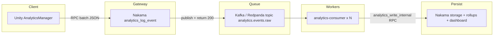

# Analytics Kafka Scale Plan — Unity + Nakama (1M+ DAU)

**Status:** Plan only (not implemented)  
**Created:** 2026-06-03  
**Owner:** Platform / Backend  
**Related:** `docs/ANALYTICS_SYSTEM_KT.md`, `docs/ANALYTICS_PHASE2_PLAN.md`, `data/modules/analytics/analytics.js`

---

## 1. Goal

Move QuizVerse analytics ingestion from **synchronous RPC processing** to a **Kafka-style async pipeline** (MY.GAMES / War Robots pattern):

```
Unity → Nakama RPC (thin gateway) → Kafka/Redpanda → Consumer workers → normalize + persist
```

Nakama stays the **only public API** for the Unity client. Unity keeps calling `analytics_log_event` — no SDK contract change.

---

## 2. What We Have Today (Already Shipped)

| Layer | State |
|-------|--------|
| **Unity** | `AnalyticsManager.FlushBatch()` chunks payloads (400 events/chunk); offline queue on failure |
| **Nakama RPC** | `analytics_log_event` cap raised to **500 events/call** |
| **Server handler** | Synchronous loop: normalize → `persistNormalizedEvent` → storage writes per event |
| **Threading** | `IVXNManager.RpcAsync` retry stays on Unity main thread (`ConfigureAwait(false)` removed) |

This is enough for **< ~100K DAU**. E2E test (320 events) works once batched into ≤500 chunks.

---

## 3. Why We Need Kafka at Scale

Today, one `analytics_log_event` RPC can block the Nakama JS runtime for hundreds of **synchronous** storage writes:

```javascript
for (var i = 0; i < inbound.length; i++) {
    normalizeInboundEvent(...);
    persistNormalizedEvent(...);  // nk.storageWrite per event
}
```

| Load | Rough math | Risk |
|------|------------|------|
| 100K DAU | ~25–50 events/session, flush every 10s | OK on current sync path |
| 1M DAU | ~2.5M RPC/min if every player flushes | Nakama JS thread saturated; RPC timeouts; dashboard lag |

Industry pattern (MY.GAMES, Amplitude, GA4): **accept fast, process async**.

---

## 4. Target Architecture



### Design principles

1. **Unity unchanged** — same RPC name, payload shape, `{ success, accepted, rejected }` response.
2. **Gateway returns in < 50ms** — validate JSON + size cap + publish to queue; no storage writes in hot path.
3. **Consumers own persistence** — reuse existing `normalizeInboundEvent` + `persistNormalizedEvent` logic (extract or internal RPC).
4. **Horizontally scalable workers** — consumer replicas + Kafka consumer group; independent of Nakama pod count.
5. **Feature flag rollout** — `ANALYTICS_KAFKA_MODE=true|false`; sync path remains fallback.

---

## 5. Unity Client Flow (No Changes Required)

```
Track() → batch buffer (25 events or 10s)
       → FlushBatch() → chunks of 400
       → IVXNManager.RpcAsync("analytics_log_event", { events: [...] })
       → expects HTTP 200 + { success, accepted, rejected }
```

**Optional later (not required for Kafka):**

- Tune `BATCH_FLUSH_SIZE` / interval for mobile battery.
- Add `insert_id` / batch sequence for dedupe across retries (Amplitude-style).

---

## 6. Nakama Gateway Mode (Planned)

### 6.1 `analytics_log_event` — thin gateway

When `ANALYTICS_KAFKA_MODE=true`:

| Step | Action |
|------|--------|
| 1 | Parse JSON; reject if invalid or `events.length > 500` |
| 2 | Lightweight validation only (required fields present — **no** storage) |
| 3 | Publish envelope to Kafka via Redpanda REST Proxy (`nk.httpRequest`) |
| 4 | Return `{ success: true, accepted: N, rejected: 0, queued: true }` immediately |

When `ANALYTICS_KAFKA_MODE=false`:

- Keep current synchronous handler (rollback / dev default).

### 6.2 New internal RPC — `analytics_write_internal`

| Property | Value |
|----------|--------|
| Auth | Shared secret header (`ANALYTICS_INTERNAL_WRITE_KEY`) — not exposed to game clients |
| Caller | `analytics-consumer` only |
| Body | Same batch shape as `analytics_log_event` |
| Logic | Existing normalize + persist loop + `bumpMetricsCounter` |

### 6.3 Kafka publish from JS (no Go plugin required)

Redpanda ships **Pandaproxy REST** on `:8082`:

```
POST /topics/analytics.events.raw
Content-Type: application/vnd.kafka.json.v2+json
{ "records": [{ "value": "<base64 or json>", "key": "<userId>" }] }
```

Nakama JS calls this with `nk.httpRequest` — avoids building a custom Go Kafka plugin.

**Alternative (production):** Go sidecar or Nakama Go plugin with native `kafka-go` producer for lower latency and backpressure metrics.

---

## 7. Kafka / Redpanda

### 7.1 Why Redpanda (dev + small prod)

- Kafka-compatible API, no Zookeeper
- Single binary, REST proxy built-in
- Same topic semantics as Kafka (consumer groups, partitions, retention)

### 7.2 Topic design

| Topic | Partitions | Retention | Purpose |
|-------|------------|-----------|---------|
| `analytics.events.raw` | 12–24 (scale with DAU) | 7d | Raw RPC payloads from gateway |
| `analytics.events.dlq` | 3 | 30d | Failed batches after max retries |

**Partition key:** `userId` or `gameId` — keeps one user's events ordered per partition.

### 7.3 Message envelope

```json
{
  "receivedAt": "2026-06-03T00:00:00Z",
  "nakamaUserId": "uuid",
  "rpcId": "analytics_log_event",
  "batchIndex": 0,
  "payload": { "events": [ ... ] }
}
```

---

## 8. Analytics Consumer Service (Planned)

**Language:** Node.js (matches existing tooling) or Go (lower memory at high throughput).

**Responsibilities:**

1. Subscribe to `analytics.events.raw` (consumer group `analytics-processor`)
2. Micro-batch: up to 100 messages or 500ms wait
3. POST to Nakama `analytics_write_internal` with shared secret
4. On failure: exponential backoff → DLQ topic after N attempts
5. Expose `/healthz` and `/readyz` for K8s

**Scaling:**

| DAU | Consumer replicas | Notes |
|-----|-------------------|-------|
| < 100K | 0 (sync mode) | Kafka optional |
| 100K–500K | 2 | KEDA on consumer lag |
| 500K–1M+ | 4–20 | Partition count ≥ max replicas |

---

## 9. Phased Rollout

### Phase 0 — Current (done)

- [x] Client batch chunking (400/chunk, server cap 500)
- [x] Main-thread RPC retry fix (`IVXNManager.cs`)
- [ ] Re-run E2E test in Play Mode; confirm `accepted > 0`

### Phase 1 — Local dev stack (~1 week)

- [ ] Add Redpanda + `analytics-consumer` to `docker-compose.yml`
- [ ] Implement gateway branch in `analytics.js` behind `ANALYTICS_KAFKA_MODE`
- [ ] Implement `analytics_write_internal` RPC
- [ ] Build consumer: Kafka → internal RPC
- [ ] Integration test: 320-event E2E with Kafka mode ON

### Phase 2 — Staging / prod shadow (~1 week)

- [ ] Deploy Redpanda StatefulSet + consumer Deployment to K8s
- [ ] Run **dual-write**: sync persist + Kafka publish; compare counters
- [ ] Alert on lag > 60s or DLQ rate > 0.1%

### Phase 3 — Production cutover

- [ ] Flip `ANALYTICS_KAFKA_MODE=true` in prod Nakama env
- [ ] Monitor: RPC p99, consumer lag, `events_accepted` counter, dashboard freshness
- [ ] Keep sync code path for 2 weeks; remove after stable

### Phase 4 — 1M+ DAU hardening

- [ ] Increase topic partitions; KEDA autoscale consumers
- [ ] Optional: dedicated ingest NGINX → Kafka (MY.GAMES full pattern) if Nakama RPC becomes bottleneck
- [ ] Consider ClickHouse / column store for query layer (separate from ingest queue)

---

## 10. Files to Create / Modify (Implementation Checklist)

### Nakama repo

| File | Action |
|------|--------|
| `docker-compose.yml` | Add `redpanda`, `analytics_consumer` services + env vars |
| `k8s/redpanda.yaml` | StatefulSet + Service |
| `k8s/analytics-consumer-deployment.yaml` | Deployment + optional KEDA ScaledObject |
| `data/modules/analytics/analytics.js` | Gateway mode + `analytics_write_internal` |
| `data/modules/analytics/analytics_kafka.js` | **New** — publish helper (REST proxy) |
| `analytics-consumer/` | **New** — Node service (package.json, index.js, Dockerfile) |
| `Dockerfile` | No change required if using REST proxy from JS |

### Unity repo

| File | Action |
|------|--------|
| `AnalyticsManager.cs` | **No change** for Kafka cutover |
| E2E test window | Optional: assert `queued: true` when Kafka mode on |

### Infra repo (`intelli-verse-kube-infra`)

| File | Action |
|------|--------|
| Nakama Helm values | `ANALYTICS_KAFKA_MODE`, `REDPANDA_REST_URL`, secrets |
| Secrets | `ANALYTICS_INTERNAL_WRITE_KEY`, Kafka broker URL |

---

## 11. Observability

| Signal | Source |
|--------|--------|
| RPC latency p50/p99 | Nakama Prometheus `:9100` |
| Events accepted/rejected today | `analytics_metrics_counters` storage |
| Kafka consumer lag | Redpanda metrics or KEDA |
| DLQ depth | Topic `analytics.events.dlq` |
| Pipeline freshness | Existing `analytics_pipeline_age_seconds` gauge |

**Alerts:**

- Consumer lag > 100K messages for 5 min
- DLQ rate > 100 msg/min
- `analytics_log_event` p99 > 500ms (gateway should stay low)

---

## 12. Rollback

1. Set `ANALYTICS_KAFKA_MODE=false` on Nakama → immediate return to sync handler.
2. Scale consumer to 0 (optional).
3. Drain Kafka backlog later with consumer scaled back up — no client redeploy needed.

---

## 13. Open Decisions

| # | Question | Recommendation |
|---|----------|----------------|
| 1 | Redpanda vs managed Kafka (MSK/Confluent)? | Redpanda for dev/small prod; MSK when ops team owns Kafka |
| 2 | REST proxy vs Go producer in Nakama? | REST for Phase 1 speed; Go plugin if p99 publish > 20ms |
| 3 | Dedupe strategy? | Batch checksum in consumer + 6h idempotency store (MY.GAMES pattern) |
| 4 | Counter bump timing? | On **persist** (consumer), not on queue publish — dashboard reflects real writes |
| 5 | E2E test with Kafka? | Add env flag in test window; skip server counter check if queue mode (check lag instead) |

---

## 14. References

- MY.GAMES — [1B events/day pipeline](https://medium.com/my-games-company/game-analytic-power-how-we-process-more-than-1-billion-events-per-day-433ef64f77b6) (Kafka → async processing)
- Amplitude — [Batch upload limits](https://amplitude.com/docs/data/data-backfill) (~10 events/batch recommended; 300 events/sec/device)
- Nakama — [Benchmarks](https://heroiclabs.com/docs/nakama/getting-started/benchmarks/) (~700 RPC/sec simple JS RPC on 1 CPU)
- Internal — `docs/ANALYTICS_SYSTEM_KT.md`, `docs/ANALYTICS_ROOT_CAUSE_AND_FIX.md`

---

## 15. Next Step

**Do not implement until approved.** Start with Phase 1 locally:

1. Redpanda in docker-compose  
2. Gateway flag in `analytics.js`  
3. Minimal consumer calling `analytics_write_internal`  
4. E2E pass with 320 events  

When ready to implement, say: *"Execute Phase 1 of ANALYTICS_KAFKA_SCALE_PLAN.md"*.
