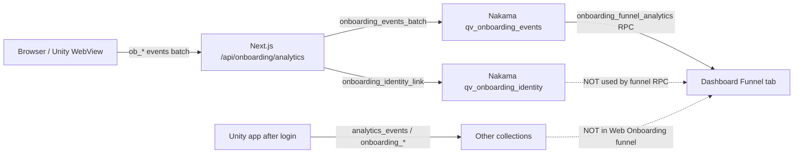

# Funnel Dashboard vs Nakama Backend — Audit Report

**Date:** 2026-06-24  
**Scope:** Analytics dashboard **Funnel tab → “Web Onboarding (Live)”** only  
**Production URL:** https://nakama.intelli-verse-x.ai/analytics.html  
**Issue reported:** 12 users in `qv_onboarding_identity` with valid `nakamaUserId`, but funnel does not reflect registered / logged-in users as expected.

---

## TL;DR for admin

| What you see in Nakama storage | What the Funnel tab shows |
|--------------------------------|---------------------------|
| 12 rows in `qv_onboarding_identity` (`link_{anonId}` → `nakamaUserId`) | **Does not read this table** for counts or user list |
| Full event history under guest `identityId` (pre-register) | Often one **guest row** — may show **“Not linked”** even when identity link exists |
| Post-register events under `nakamaUserId` | Often a **second row** for the same person — only post-link events |
| Unity in-app activity (`analytics_events`, `onboarding_state`) | **Not in this funnel** — separate pipeline |

**Bottom line:** Identity links are saved correctly. The funnel **aggregates users by event key**, not by the identity-link table, so one real user can appear as two rows (or as “Not linked”) and screen/drop-off stats are split.

---

## End-to-end flow (intended)



### Ingest (web)

1. Every screen/action → `ob_*` events → `POST /api/onboarding/analytics` → RPC `onboarding_events_batch`.
2. Events stored on **system user** `00000000-0000-0000-0000-000000000000` in `qv_onboarding_events`.
3. After register, events are **also** copied to the player’s `nakamaUserId` storage.
4. On register, `linkIdentityAtRegister()` → RPC `onboarding_identity_link` → `qv_onboarding_identity` key `link_{anonId}`:

```json
{
  "anonId": "39e00edf-fc89-4cbb-bb83-20812c5afde5",
  "userId": "2c6bbe92-6165-4f34-b0e0-70ce3dbfc469",
  "nakamaUserId": "686ffb07-ba81-4e41-9d60-b2df4de18e36",
  "cognitoSub": "2c6bbe92-6165-4f34-b0e0-70ce3dbfc469",
  "linkedAt": 1782352179471
}
```

### Dashboard Funnel tab (live mode)

- Mode selector must be **“Web Onboarding (Live)”** (not “Canonical (Rollup)” or legacy `analytics_funnel`).
- Calls RPC **`onboarding_funnel_analytics`** with date range (`selectedDays`, default often 7 days).
- Panels: KPIs, screen funnel, drop-off hotspots, pathway breakdown, event signals, user table.
- Click user row → **`onboarding_user_journey`** → full event timeline (tree).

---

## Root cause: user key split (why 12 links ≠ 12 clear “registered” rows)

Funnel aggregation uses this key per event:

```391:393:data/modules/src/onboarding/onboarding-analytics.ts
  function resolveUserKey(rec: any): string {
    return (rec.nakamaUserId || rec.identityId || rec.userId || "").toString();
  }
```

| Phase | Typical event fields | Funnel user key |
|-------|----------------------|-----------------|
| Pre-register | `identityId` = anon UUID, no `nakamaUserId` | **Guest anon ID** |
| After register | `nakamaUserId` set on batch | **Nakama UUID** |
| Unity server hooks (`ob_d1_return`, etc.) | `identityId` = `nakamaUserId` | **Nakama UUID** |

**Same person → two funnel users.** Pre-register screens sit on the guest key; post-register / app events sit on the Nakama key.

The user table shows “Not linked” when the row’s aggregated `nakamaUserId` is empty — even if `qv_onboarding_identity` already has the link:

```5727:5728:web/analytics-dashboard/index.html
                    (uid ? ' ... ' : '') +
                    (!uid && guest ? ' <span class="ob-status-pill ob-status-preregister">Not linked</span>' : '') + '</td>' +
```

**`qv_onboarding_identity` is never loaded during `scanOnboardingEvents`.** Links exist in storage but do not merge guest + Nakama buckets for KPIs, screen funnel, or drop-offs.

### Secondary factors

| Factor | Effect |
|--------|--------|
| **Date range** | Only events with `timestamp` in `[sinceMs, untilMs]` count. Widen to 30–90 days if users registered outside default window. |
| **Scan cap** | System lake scan stops at **400 × 100 = 40k** objects; `truncated: true` → incomplete funnel on heavy traffic. |
| **Status filter** | “Pre-register only” hides rows that have `identityLinked` or `nakamaUserId` on any event in that bucket. |
| **App login ≠ web funnel** | Successful Unity login does not automatically appear here unless `ob_*` events were emitted (e.g. `ob_app_launch_success`, server `ob_d1_return`). |
| **Journey vs funnel** | Per-user **timeline** merges guest + Nakama events correctly (`loadEventsForUser`); **aggregate funnel does not**. |

---

## What each funnel panel actually uses

| Panel | Source | Notes |
|-------|--------|-------|
| Started / Completed / Paywall KPIs | System `qv_onboarding_events` only | User count = distinct `resolveUserKey` — **can double-count** |
| Screen funnel & drop-offs | `ob_screen_seen` / `ob_screen_exit` per user bucket | Split across guest vs Nakama keys → **wrong step order & drop %** for registered users |
| Pathway breakdown | `userSnapshot.pathway`, screen URL, `currentStep` | OK if events exist; guest-only bucket may lack pathway if user picked path then registered |
| Event signals | Flags like `ob_register_start`, `ob_app_launch_success` | Per bucket — register on guest row, app launch on Nakama row |
| User table | Same scan as above, max **500** rows | Search by Nakama UUID may hit the **short** post-link row only |
| User journey (modal) | System lake + player storage, merged by guest + Nakama | **This is the accurate per-user tree today** |

---

## Your 12 identity links — how to verify manually

For each `link_*` row in **Storage Browser → `qv_onboarding_identity`**:

1. Note `anonId` and `nakamaUserId`.
2. In Funnel → user table, search **guest ID** → expect a row; may say **Not linked**.
3. Search **Nakama UUID** → may find a **different row** with fewer events.
4. Click either row (pass both IDs if possible) → journey modal should show **combined** timeline if both guest and player events exist.

If journey modal is full but table/KPIs look wrong → confirms **aggregation bug**, not missing ingest.

---

## Gaps vs goal (“full event tree, screen exit, drop-offs”)

| Goal | Status |
|------|--------|
| Store every screen enter/exit | ✅ `ob_screen_seen` / `ob_screen_exit` in `qv_onboarding_events` |
| Link guest → registered user | ✅ `qv_onboarding_identity` |
| Single unified user in funnel | ❌ Not merged in `onboarding_funnel_analytics` |
| Screen sequence & drop-off for full journey | ⚠️ Split keys → misleading aggregates |
| Post-app Unity screens | ❌ Not in `ob_*` lake (use `analytics_events` / Player 360) |
| Admin tree view | ✅ Journey modal only; not in main funnel charts |

---

## Recommended fixes (priority)

### P0 — Merge identity links in funnel RPC

In `scanOnboardingEvents` (or post-scan pass):

1. Load all `qv_onboarding_identity` links (or links in date range).
2. Map `anonId` → canonical `nakamaUserId` (prefer Nakama when linked).
3. Merge user buckets before screen funnel, KPIs, and user rows.
4. Set `nakamaUserId` + `identityLinked: true` on merged row from link table even if events lack `nakamaUserId`.

### P1 — Backfill event records (optional)

For linked users, copy or re-key pre-register system events to include `nakamaUserId` at link time so raw storage matches canonical user.

### P2 — Dashboard UX

- Show “Linked (12 in identity table, N in funnel)” sanity metric.
- User table: prefer link table for Nakama column; badge “Linked in storage” when `qv_onboarding_identity` exists.
- Default funnel range 30 days for low-volume prod.

### P3 — Post-app tracking

Decide single source of truth for in-app screens: extend `ob_*` from Unity WebView/deeplink, or build a cross-pipeline view — current funnel will never show pure Unity navigation.

---

## Quick admin checklist

- [ ] Funnel mode = **Web Onboarding (Live)**
- [ ] Date range includes registration dates (try **30** or **90** days)
- [ ] Check **Storage → `qv_onboarding_identity`** count vs funnel user table count (expect mismatch until P0 fix)
- [ ] For one known user, open **journey modal** — compare to funnel row
- [ ] For app-only activity after login, use **Events** / **Player 360** tabs, not this funnel

---

## Code references

| Piece | Location |
|-------|----------|
| Event ingest & identity link | `data/modules/src/onboarding/onboarding-analytics.ts` |
| Funnel RPC | `onboarding_funnel_analytics` in same file |
| Journey merge (works) | `loadEventsForUser()` in same file |
| Dashboard funnel UI | `web/analytics-dashboard/index.html` → `loadOnboardingFunnelAnalytics()` |
| Web client batch + link | `Quizverse-web-frontend/web/lib/onboarding/analytics.ts`, `web/app/api/onboarding/analytics/route.ts` |
| Storage model doc | `docs/ONBOARDING_DATA_IN_NAKAMA.md` |

---

*Generated from repo analysis. Live dashboard is admin-auth gated; RPC behavior matches deployed Nakama module code in this workspace.*
